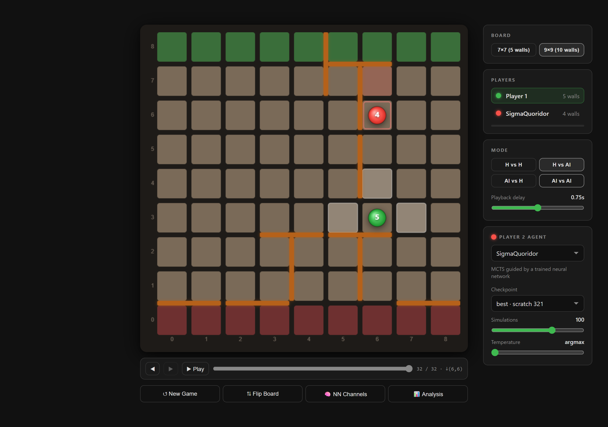
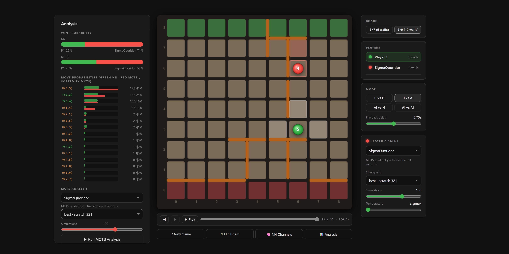

# SigmaQuoridor

An AlphaZero-style engine for the board game **[Quoridor](https://en.wikipedia.org/wiki/Quoridor)**,
trained from zero knowledge — no opening book, no human games, no hand-written evaluation.
Just the rules, self-play, and a neural network that learns from its own games.

### ▶ [**Play it in your browser →**](https://bartolomeo3000.github.io/SigmaQuoridor/)

No install, nothing to download — the network runs client-side in your browser via ONNX.

<!-- SCREENSHOT: a game in progress on the 9x9 board, sidebar visible.
     Save as docs/screenshots/board.png and uncomment:

-->

---

## What it achieves

The 9×9 network reached a level where **it beats a strong public Quoridor AI
([gorisanson's quoridor-ai](https://gorisanson.github.io/quoridor-ai/)) as both first and second
player using no search at all** — one forward pass, playing the arg-max of the policy head, no
MCTS. With search on top it is considerably stronger still.

The current network is the product of a from-scratch run on one desktop GPU:

| | |
|---|---|
| Board | 9×9, 10 walls per player |
| Training | 321 cycles · 2048 self-play games each · 800 MCTS sims/move |
| Compute | **35.7 h total** on one RTX 5070 Ti (27.2 h self-play + 8.4 h network training) |
| Gradient steps | 319,000 |
| Network | 128 filters × 10 residual blocks, KataGo-style global pooling every 3rd block |

That is the headline point for anyone considering this approach: **superhuman-ish play on a
non-trivial game, from random weights, in a day and a half on consumer hardware.**

Progress is tracked by round-robin Elo tournaments between checkpoints
(`runs/tournaments/`), which is the only reliable measure once the engine is past the point
where a human — or the reference bot — can beat it.

---

## How it works (AlphaZero in five minutes)

If you already know AlphaZero, skip to [Setup](#setup).

Classical engines (Stockfish-style) search deeply and score positions with a hand-written
evaluation function. AlphaZero replaces the hand-written parts with a neural network that is
trained *only* on games the engine plays against itself.

**The network.** One network, two outputs ("heads"), fed a stack of planes describing the
board position:

- a **policy** head — a probability over every legal move: *"which moves look worth considering?"*
- a **value** head — a single number in [-1, +1]: *"who is winning, and by how much confidence?"*

**The search.** The network alone is a decent intuition but a poor calculator, so it is wrapped
in **Monte-Carlo Tree Search (MCTS)**. Each "simulation" walks down the game tree, picking moves
that balance *the network's prior* against *how well that move has scored so far* and *how
rarely it has been tried* (the PUCT rule). At the leaf, instead of playing the game out
randomly, it just asks the network "who's winning here?" and propagates that answer back up.
Run a few hundred simulations and the visit counts across the root's children are a **better**
move distribution than the raw policy — search sharpens intuition.

**The loop.** That improvement is the entire training signal:

```
        ┌─────────────────────────────────────────────┐
        │                                             │
        ▼                                             │
  ┌───────────┐    games     ┌───────────┐   better   │
  │ SELF-PLAY │ ───────────► │   TRAIN   │ ─ weights ─┘
  │ MCTS + NN │              │  policy → │
  └───────────┘              │  MCTS's   │
   store for each move:      │  visits   │
   • position                │  value →  │
   • MCTS visit counts       │  who won  │
   • who eventually won      └───────────┘
```

1. **Self-play** — the current network plays thousands of games against itself. For every
   position, record the MCTS visit distribution and, at the end, who won.
2. **Train** — nudge the policy head toward the visit counts (which were better than its own
   guess) and the value head toward the actual result.
3. **Repeat** — the improved network makes better self-play games, which make a better training
   target, and so on.

Nothing in that loop knows anything about Quoridor beyond the legal-move generator and who won.
That is why the approach ports to other games — see
[Adapting this to another game](#adapting-this-to-another-game).

**Where this implementation differs from the paper:**

- **No promotion gate.** Every cycle's weights are kept; there's no "only accept the new network
  if it beats the old one by 55%" step. Progress is verified after the fact with tournaments.
- **Exact endgame solver.** Once few enough walls remain, positions are solved exactly by
  alpha-beta instead of guessed by the network, giving perfect training labels for endgames.
- **A shared transposition table** caches network evaluations across the thousands of games
  running concurrently, which is a large part of the throughput.

---

## Using the web app

[**bartolomeo3000.github.io/SigmaQuoridor**](https://bartolomeo3000.github.io/SigmaQuoridor/) —
everything runs in your browser (ONNX Runtime Web); no data leaves your machine.

**Making moves.** Both move types are a plain left-click on the board:

- **Move your pawn** — legal destination squares are highlighted; click one. Jumps over the
  opponent and diagonal go-arounds are already resolved into destinations, so you just click
  where you want to end up.
- **Place a wall** — hover the *groove between cells*. A preview appears: **orange** = legal,
  **red** = illegal (overlaps, or would completely seal off a player). Orientation is inferred
  from which gap you're hovering, so there's no mode switch or right-click.

**Controls worth knowing:**

| Control | What it does |
|---|---|
| **Board** | `7×7 (5 walls)` or `9×9 (10 walls)` — 9×9 is the default and the stronger net |
| **Agent** | `SigmaQuoridor` (net + MCTS), `MCTS` (pure random rollouts), `Minimax` (depth 2–8) |
| **Checkpoint** | `best (scratch cycle 321)` or `previous best (heads cycle 56)` — play the current net against its predecessor |
| **Simulations** | 1 → 5000, default **100**. This is the AI's thinking budget: 1 = raw network intuition with no search, 5000 = slow and very strong |
| **Mode** | `H vs AI` (default), `AI vs H` (AI moves first), `H vs H` |
| `↩ Undo Move` | Takes back your move *and* the AI's reply |
| `⇅ Flip Board` | Flip orientation |

**Two things that make it more than a game UI:**

- **📊 Analysis** — win-probability bars (the network's value head, plus the MCTS root value once
  a search finishes) and a ranked move list showing the **network's prior (green) against MCTS's
  visit counts (red)** side by side. That contrast is precisely the "search improves on intuition"
  step described above, made visible. You can hover a row to highlight the move, click to play it,
  and analyze with a *different* checkpoint than you're playing against.
- **🧠 NN Channels** — renders all 8 input planes the network actually sees (pawns, walls,
  walls-in-hand, BFS distance-to-goal maps), from the side-to-move's perspective.

Try setting Simulations to **1** — that's the pure policy head, no search at all, and it still
plays a respectable game.

<!-- SCREENSHOT: the Analysis panel open, showing NN-vs-MCTS move bars.
     Save as docs/screenshots/analysis.png and uncomment:

-->

---

## Setup

Only needed if you want to **train** or **modify** the engine — to just play, use the link above.

**Prerequisites**

- **Python 3.13**
- **A C++17 compiler** — MSVC Build Tools on Windows, gcc/clang elsewhere. The `quoridor_cpp`
  extension is *not* distributed as a binary; you build it locally.
- **An NVIDIA GPU** for realistic training speed (CPU works but is impractically slow for
  self-play).

```bash
git clone https://github.com/bartolomeo3000/SigmaQuoridor.git
cd SigmaQuoridor

python -m venv .venv
# Windows: .venv/Scripts/python   ·   Linux/macOS: .venv/bin/python
.venv/Scripts/python -m pip install -U pip setuptools

# Install torch FIRST, from the index matching your CUDA version.
# A plain `pip install torch` may give you a CPU-only wheel that runs but crawls.
.venv/Scripts/pip install torch --index-url https://download.pytorch.org/whl/cu128

.venv/Scripts/pip install -r requirements.txt

# Build the C++ engine (produces quoridor_cpp*.pyd / .so in the repo root)
.venv/Scripts/python setup_cpp.py build_ext --inplace
```

**Verify the build** — this is the test that matters, because it proves the C++ engine agrees
with the Python reference engine move-for-move:

```bash
.venv/Scripts/python tests/test_cpp_parity.py --games 50
# -> all parity checks passed (N moves compared)
```

Then confirm the GPU is actually being used:

```bash
.venv/Scripts/python -c "import torch; print(torch.cuda.is_available(), torch.version.cuda)"
```

**Two things that will bite you otherwise:**

- **Run every command from the repo root.** All artifact paths are relative to the working
  directory.
- **After editing any `cpp/*.hpp`, delete `build/` and the compiled extension before
  rebuilding.** `build_ext --inplace` does not reliably notice header-only changes, and you will
  silently keep testing the old engine:
  ```bash
  rm -rf build && rm -f quoridor_cpp*.pyd quoridor_cpp*.so
  .venv/Scripts/python setup_cpp.py build_ext --inplace
  ```

---

## Train your own engine

Training artifacts live in **lineages**: a matched pair of directories
`runs/models_<name>/` (weights) and `runs/data_<name>/` (self-play data). They are paired by
naming convention — the `models_`/`data_` prefix swap is how the scripts find one from the other.

### 1. Create a lineage from random weights

```bash
python train.py --model-dir runs/models_myrun --cycles 0
```

`--cycles 0` means "initialise and exit": it writes random-init weights to
`runs/models_myrun/best.pt` and creates `checkpoints/` and `runs/data_myrun/`, without running
any (slow, pure-Python) self-play.

> Ignore the hint printed by `cpp_train_loop.py` suggesting `selfplay_cpp.py` without `--model`.
> That does create a random network, but it never *saves* one — and its defaults are 7×7/64×6,
> which won't match your lineage. Use the command above.

Architecture is fixed at creation time via `--filters` / `--res` / `--gpool-every` /
`--value-head` / `--pawn-head` (defaults: 128 filters, 10 blocks, global pooling every 3rd block,
pooled value head, local pawn head). Board size comes from `BOARDSIZE` in `train.py`, not a flag.
Checkpoints are **self-describing** — `load_model()` re-derives all of it from the weights, so you
never have to remember what you trained.

### 2. Run the training loop

```bash
python cpp_train_loop.py --model-dir runs/models_myrun --cycles 50 --games 2048 --sims 800 --bf16
```

Each cycle: generate `--games` self-play games with the current net (C++, many games in parallel)
→ append them as `runs/data_myrun/cycle_NNNN.npz` → train on a replay buffer of the last
`--buffer-cycles` (default 30) cycles → overwrite `best.pt`, save a checkpoint, append a row to
`training_stats.csv`.

The two halves run as **separate subprocesses**, so the loop survives a crash in either and you
can stop it between cycles with no loss.

Knobs that matter most:

| Flag | Default | Effect |
|---|---|---|
| `--games` / `--sims` | 2048 / 800 | The main cost/quality trade: how much data per cycle, and how good the MCTS targets are |
| `--parallel` / `--max-batch` | 2048 / 512 | Throughput. More concurrent games = bigger GPU batches |
| `--threads` | 7 | C++ search threads; roughly your physical core count |
| `--bf16` | off | Near-free speedup on modern NVIDIA GPUs — turn it on |
| `--lr` | 3e-4 | Learning rate |
| `--buffer-cycles` | 30 | How much history to train on; higher = more stable, more stale |
| `--solver-max-total-walls` | 2 | Exact endgame solving once few walls remain (see gotchas) |

### 3. Watch it learn

`runs/models_<name>/training_stats.csv` gets one row per cycle. The columns actually worth
watching:

- **`value_accuracy`** — how often the value head's sign matches the game result. The single most
  interpretable learning signal.
- **`loss_policy` / `loss_value`** — but note these are *in-sample on a moving buffer*, so they
  measure fit to current self-play, not strength. Falling loss is not proof of improvement.
- **`selfplay_time_s` / `train_time_s` / `cumulative_time_s`** — throughput and total compute.

Console output is teed to `runs/logs/`. Per-game statistics (game length, walls placed, win
balance) only appear in `runs/logs/selfplay_*.log`, not the CSV, because self-play happens in
a subprocess.

### 4. Measure actual strength

**Loss curves do not tell you if the engine got stronger** — and there's no promotion gate here,
so `best.pt` just means "latest". The real measure is checkpoints playing each other:

```bash
# One-off round robin over a lineage's checkpoints
python tournament_cpp.py --dir runs/models_myrun/checkpoints --games 100 --sims 800 --temp 0.3
```

For tracking progress over a long run, use a **series** — each version reuses the previous
version's games, so adding a checkpoint only plays the genuinely new pairings:

```bash
python tournament_cpp.py --series myrun --add runs/models_myrun/checkpoints/cycle_0100.pt
```

It infers everything else (roster, games/pair, rules config, output path, which games to reuse)
from the previous version in `runs/tournaments/myrun/`. Elo is a Bradley-Terry fit over all
results.

Sanity-check search value too — the same weights at different budgets should show a clear
ladder:

```bash
python tournament_cpp.py --model runs/models_myrun/best.pt --sim 100 --sim 800 --sim 2000 --games 100 --temp 0
```

---

## Adapting this to another game

The training loop knows nothing about Quoridor. What's game-specific is the rules engine, the
action encoding, and the input planes.

### The two-engine contract

Rules exist **twice**: `game.py` (readable Python reference) and `cpp/engine.hpp` (a from-scratch
C++ reimplementation with bitsets and Zobrist hashing — not a translation). The C++ one is what
makes training fast; the Python one is what keeps it honest.

`tests/test_cpp_parity.py` is the contract between them. It plays identical random games through
both, and every ply asserts they agree on: the **legal action set**, all **8 NN input planes**,
**terminal status**, and the **winner** — across 7×7, 9×9 and 5×5. Change a rule in one engine
and forget the other, and this fails on the first divergent ply.

**Run it after every rules change.** A silent mismatch means self-play generates data under
different rules than your reference — the kind of bug that costs a training run.

### Action encoding

Every move is an integer index, and both engines must agree on the mapping:

```python
action_space_size(N) = 8 + 2 * (N - 1)**2      # game.py:986
```
```cpp
action_space(N)      = 8 + 2 * (N - 1) * (N - 1);   // cpp/engine.hpp:45
```

`8` = the pawn directions (4 orthogonal + 4 diagonal go-arounds; straight jumps reuse the
orthogonal index). `2 * (N-1)²` = wall placements: an `(N-1)×(N-1)` anchor grid, × 2 orientations,
horizontal block first, row-major. 9×9 → 136 actions.

Python uses `action_to_index` / `index_to_action` (`game.py`); the C++ side inlines the same
arithmetic in `gen_legal` / `apply`.

### Network interface

Input is `(B, 8, N, N)`: my pawn, opponent pawn, horizontal walls, vertical walls, my walls left,
opponent walls left, BFS distance-to-my-goal, BFS distance-to-opponent-goal. Built by
`State.to_nn_input()` (`game.py`) and mirrored exactly by `GameState::nn_input()`
(`cpp/engine.hpp`).

Output is `(policy_logits, value)` — raw logits over the full action space (softmax happens later,
over legal moves only) and a `tanh` value from the side-to-move's perspective.

### What to change

**Same game, different board size** — most of the stack is already `N`-parametric:

1. `MAXN` in `cpp/engine.hpp` (currently 9) — fixed-size arrays are sized from it.
2. The `boardsize must be odd and <= 9` guard (in all three engines).
3. Defaults in `game.py`, `dual_network.py`, `cpp/bindings.cpp`, `docs/game.js`.
4. The hardcoded **200-ply draw limit** — must change in both engines together or parity breaks.
5. Add the size to the parity test's list and re-run it.
6. Retrain — checkpoints are board-size-specific.

Odd sizes only, currently: starting columns are `N/2`.

**A genuinely different game** — work in dependency order: `game.py` → `cpp/engine.hpp` →
`cpp/bindings.cpp` (the literal `8` appears in several array shapes) → `dual_network.py`
(`IN_CHANNELS`, and the policy head's pawn/wall split is Quoridor-shaped) → `mcts.py`, `train.py`,
`cpp/selfplay.hpp` → `export_onnx.py` → the JS engine in `docs/`. Rewrite the parity test's
expectations alongside.

### The canonicalization trap

Worth understanding before you port, because it cost this project a training run.

The network has **no side-to-move input** — the board is always presented from the mover's
perspective, so for player 2 it is flipped vertically. That means a position and its role-swapped
mirror produce *byte-identical* input tensors. The policy target must therefore be flipped
through the matching permutation too, or the two cases demand opposite outputs from identical
input, and the policy just blurs.

The flip must be applied consistently at **all four** sites: training targets (`train.py`),
Python serving (`NNEvaluator`), C++ self-play (`cpp/selfplay.hpp`), and the browser
(`docs/mcts_worker.js`). Get it wrong in one place and nothing crashes — the value head is fine,
legality masking still passes, and the agent simply plays nonsense as player 2. It shows up as
"the model is weirdly bad" long before it shows up as a bug.

`tests/test_canon_consistency.py` guards this by asserting a position and its role-swapped twin
produce mirror-image advice.

---

## Project structure

```
SigmaQuoridor/
│
├─ Core engine ─────────────────────────────────────────────────────────────
│  game.py              Canonical pure-Python rules: State, legal moves, BFS, action encoding
│  mcts.py              PUCT MCTS against a pluggable Evaluator (network or random rollout)
│  dual_network.py      Policy+value ResNet, NNEvaluator, self-describing save/load
│  cpp/                 Second, from-scratch C++ engine (pybind11) — kept in parity with game.py
│    ├─ engine.hpp        rules, BFS, Zobrist hashing, action encoding
│    ├─ selfplay.hpp      SelfPlayManager: leaf-parallel MCTS, GIL-free worker threads
│    ├─ tournament.hpp    TournamentManager: cross-play games
│    ├─ alphabeta.hpp     exact endgame solver
│    └─ bindings.cpp      pybind11 module definition
│  setup_cpp.py         Builds the above into quoridor_cpp*.pyd / .so
│
├─ Training ────────────────────────────────────────────────────────────────
│  cpp_train_loop.py    ★ Production entry point: alternates self-play and training
│  selfplay_cpp.py      Self-play data generation only -> cycle_NNNN.npz
│  train.py             Training half (--train-only), lineage bootstrap, stats CSV
│  supervised_train.py  Supervised training directly on recorded self-play data
│
├─ Evaluation ──────────────────────────────────────────────────────────────
│  tournament_cpp.py    ★ C++ round-robin Elo; --series for incremental tracking
│  tournament.py        Pure-Python equivalent; supplies the Bradley-Terry Elo solver
│  benchmark_agents.py  Baseline opponents: Random, GreedyDistance, Minimax, RawPolicy
│  eval_*.py            Ad-hoc evaluation scripts
│
├─ Serving ─────────────────────────────────────────────────────────────────
│  app.py               Flask server + JSON API for local play
│  export_onnx.py       Exports .pt checkpoints to ONNX for the web frontend
│  static/              Frontend served by app.py
│  docs/                GitHub Pages site — a third engine implementation, in JavaScript
│    ├─ index.html        UI, board renderer, agent/model pickers, analysis panel
│    ├─ game.js           JS port of game.py
│    └─ mcts_worker.js    Web Worker: MCTS + onnxruntime-web inference
│
├─ Tests & tooling ─────────────────────────────────────────────────────────
│  tests/               Verification CLIs, run directly (no pytest)
│    ├─ test_cpp_parity.py         ★ C++ engine vs Python reference
│    ├─ test_canon_consistency.py    policy-frame canonicalization
│    └─ test_head_redesign.py        network head variants
│  tools/               One-off analysis/debug/setup scripts (not maintained pipeline)
│
└─ runs/                ALL generated artifacts (gitignored except results)
   ├─ models_<name>/      best.pt, checkpoints/cycle_NNNN.pt, training_stats.csv
   ├─ data_<name>/        self-play cycle_NNNN.npz  (gitignored — regenerable, GBs)
   ├─ tournaments/        Elo results per series
   └─ logs/               console transcripts (gitignored)
```

Each of `tests/` and `tools/` has a `_bootstrap.py` that puts the repo root on `sys.path`; a new
script there needs `import _bootstrap` before importing project modules.

---

## Gotchas

Things that fail *quietly* — collected the hard way.

- **Run everything from the repo root.** Paths are relative to the working directory.
- **`best.pt` means "latest", not "best".** There is no promotion gate; every cycle overwrites it.
  Confirm with a tournament before trusting or deploying a checkpoint.
- **Rebuild properly after touching `cpp/*.hpp`** — delete `build/` and the extension first, or
  you'll test stale code (see [Setup](#setup)).
- **Model and data directories are paired.** Point a script at a mismatched pair and it trains on
  the wrong buffer instead of erroring.
- **Falling loss ≠ a stronger engine.** Losses are in-sample on a moving buffer. Only head-to-head
  results are evidence.
- **The endgame solver can stall self-play.** `--solver-max-total-walls 2` occasionally hit 4-second
  timeouts that starved the search threads; `1` solves ~30k endgames per cycle with zero timeouts.
  Watch the `solver: N calls, M timeouts` line — if `M` climbs, lower the cap or the time limit.
- **Don't delete checkpoints that appear in a tournament series roster.** Game reuse matches on
  model path; if the file is gone, those pairs can neither be reused nor replayed.
- **Benchmark numbers are hardware-specific.** Anything in `docs/cpp_selfplay_notes.md` measured on
  Apple MPS is not a valid baseline for CUDA. Re-sweep batch/parallel settings on your own machine.

---

## Further reading

- [`CLAUDE.md`](CLAUDE.md) — architecture notes and conventions (written for AI assistants, but
  it's the densest description of how the pieces fit)
- [`docs/cpp_selfplay_notes.md`](docs/cpp_selfplay_notes.md) — benchmark history and design
  rationale for the C++ self-play path; read before changing it
- [`BREAKTHROUGH.md`](BREAKTHROUGH.md) — running log of milestone results

## License

See [LICENSE](LICENSE).
