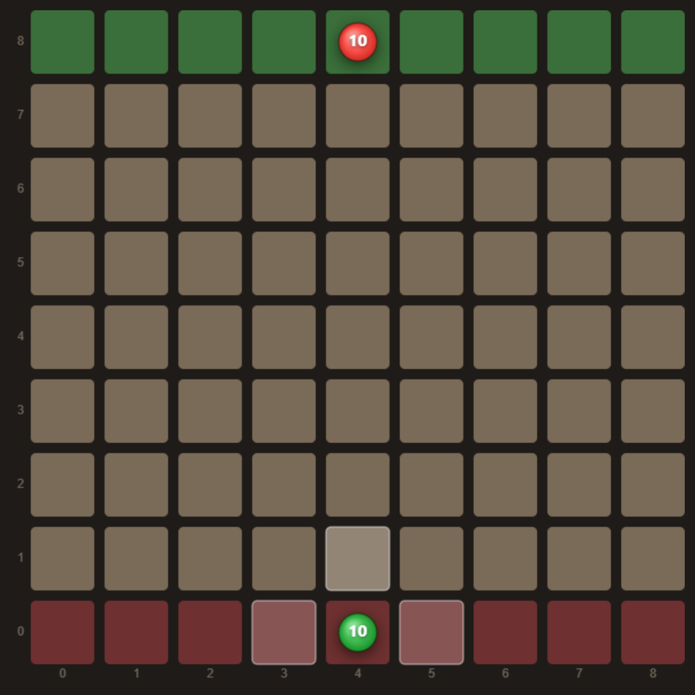
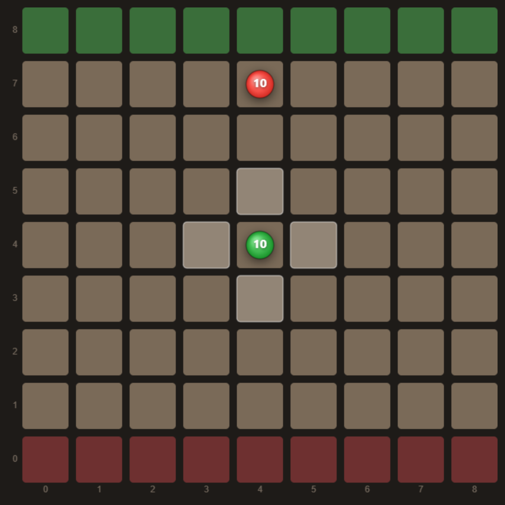
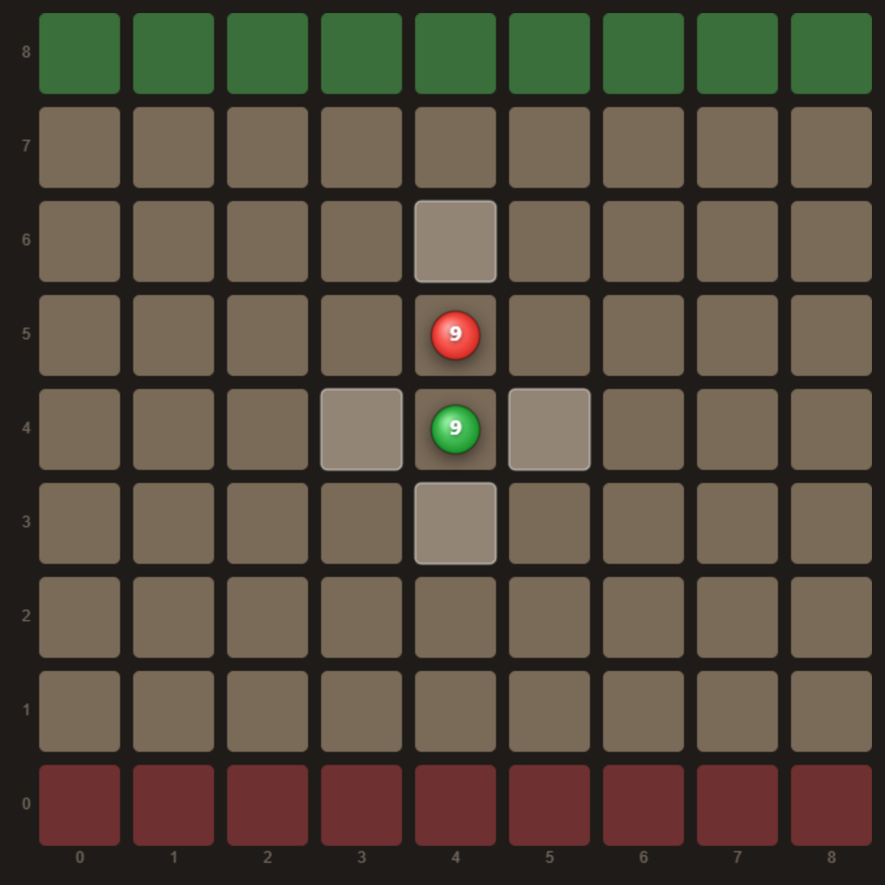
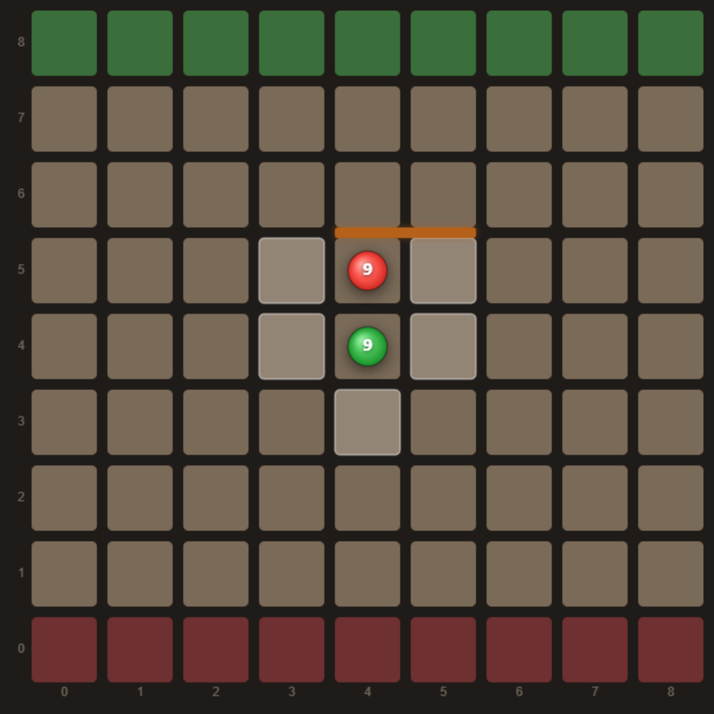
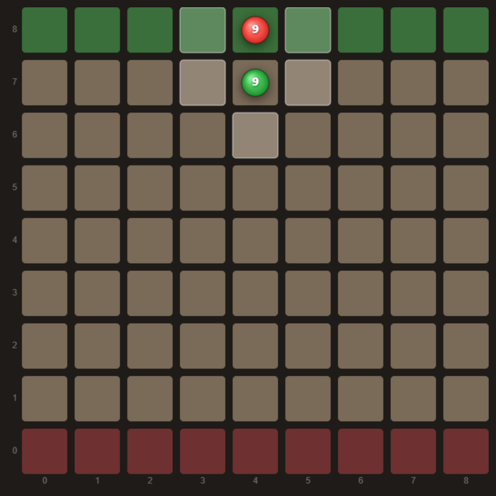
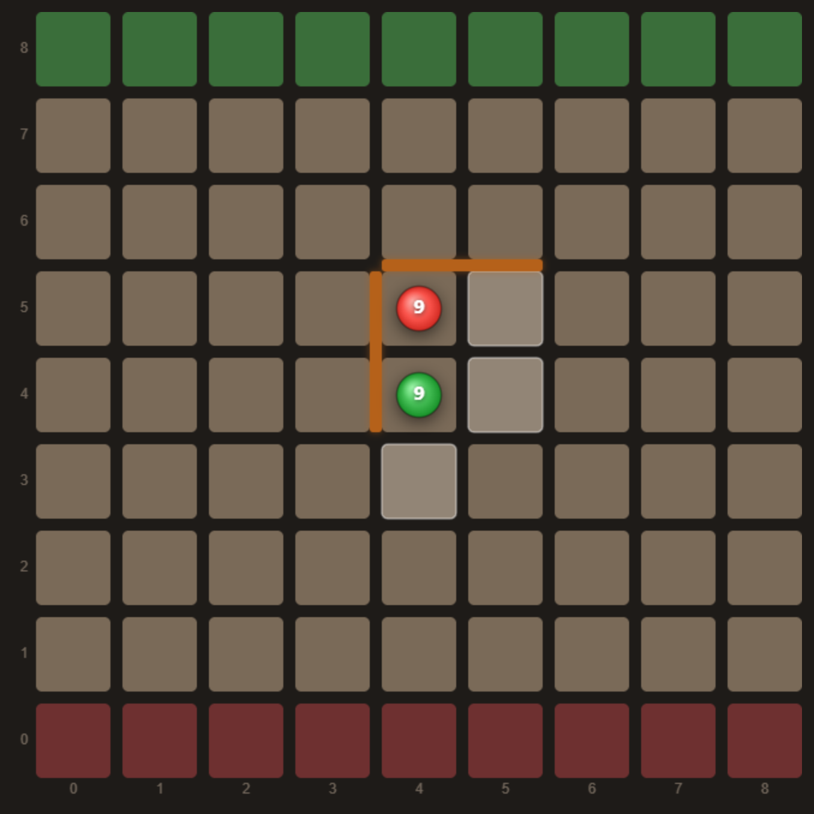
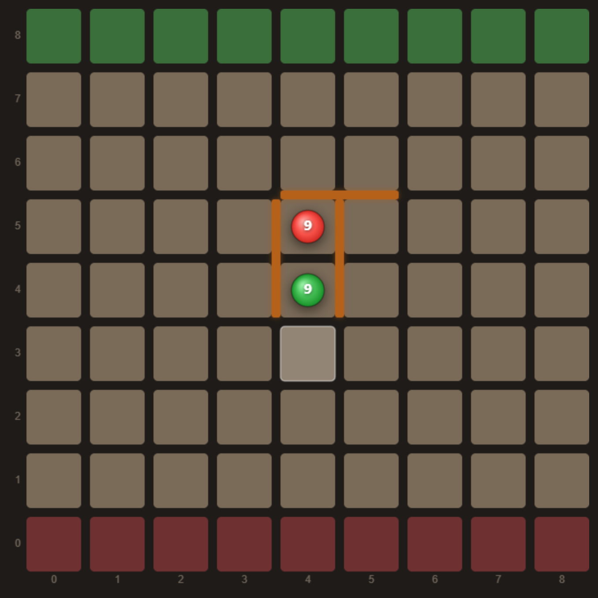
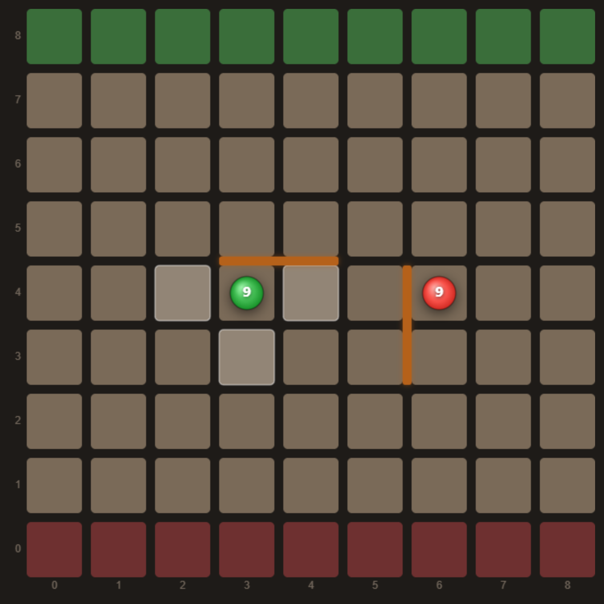
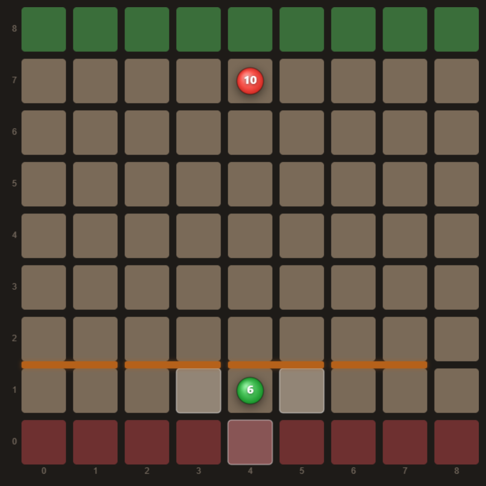

# The rules of Quoridor

A visual walk-through of the rules, **exactly as this repository implements them**
([`game.py`](game.py) is the reference; [`cpp/engine.hpp`](cpp/engine.hpp) mirrors it).

Every diagram below was produced by driving the actual engine into that position and
screenshotting the board, so the highlighted squares are the moves it really considers legal —
nothing here is drawn by hand.

> A few details differ from the boxed board game — most notably a repetition rule and a move
> limit. Those are marked **[implementation]** and collected in
> [Differences from standard Quoridor](#differences-from-standard-quoridor).

---

## The goal

Two pawns start on opposite edges, centred.

- **Green (Player 1)** starts on the bottom row and wins by reaching **any square of the top row**.
- **Red (Player 2)** starts on the top row and wins by reaching **any square of the bottom row**.

Each player also holds a supply of **walls** (10 each on 9×9, 5 each on 7×7) used to lengthen the
opponent's route. Coordinates are `(x, y)` with **`(0,0)` at the bottom-left**; the number on each
pawn is how many walls that player still holds.

**On your turn you do exactly one of two things:** move your pawn, or place a wall. You cannot
pass, and once placed a wall is never removed.

---

## Moving the pawn

A pawn moves **one square up, down, left or right** — never diagonally, except when jumping (below).
It may not move through a wall or off the board. The lighter squares above are exactly the moves
the engine offers here.

---

## Jumping

When the two pawns are **face to face** — orthogonally adjacent with no wall between them — the
mover may jump.

### Straight jump

If the square **directly behind** the opponent is on the board and not walled off, you jump
straight over and land there. Green is at `(4,4)`, red at `(4,5)`; moving "up" lands green on
`(4,6)`, skipping over red entirely.

The two pawns can never occupy the same square, and a jump is a single move.

### Diagonal jump — blocked by a wall

If the straight jump is **blocked by a wall**, you may instead step diagonally to either side of
the opponent. Here a wall sits immediately behind red, so `(4,6)` is unreachable — and the engine
offers `(3,5)` and `(5,5)` instead, going around red to the left or right.

This is the key conditional: **the diagonals only unlock when the straight jump is unavailable.**
In the straight-jump diagram above, the diagonals are *not* offered.

### Diagonal jump — blocked by the edge

The board edge blocks a jump the same way a wall does. Red stands on the top row with green
directly below it, so there is no square behind red to land on — and the same two diagonal
go-arounds open up.

### …but only if the diagonal itself is clear

A blocked straight jump *offers* the diagonals — it doesn't guarantee them. Each diagonal is only
legal if the **sideways step out of the opponent's square** is itself unobstructed, and that step
has to clear both a wall and the board edge.

Above, the horizontal wall blocks the straight jump as before, but a second wall now runs down the
left side of the two pawns. Stepping from red's square to `(3,5)` would cross it, so **the up-left
jump is not offered** — the engine leaves only `(5,5)` (up-right), plus the ordinary retreats to
`(5,4)` and `(4,3)`. Note the same wall independently blocks green's plain left step to `(3,4)`.

Wall off **both** sides and the jump disappears entirely. With the straight jump and both diagonals
blocked, green's only legal move here is to retreat to `(4,3)` — a single legal pawn move in the
whole position.

So a pawn standing face to face with its opponent has, in order: the straight jump if the square
behind is free; otherwise whichever diagonals are individually reachable; otherwise no jump at all.

---

## Walls

A wall is **two squares long** and sits in the groove *between* squares, not on them:

- a **horizontal** wall blocks vertical movement across the boundary it lies on, for both columns it spans
- a **vertical** wall blocks horizontal movement across the boundary it lies on, for both rows it spans

Walls block **all** pawn movement across them — yours as much as your opponent's — and they never
move once placed. Each wall you place is deducted from your supply; when you run out, you can only
move your pawn.

Internally a wall is identified by its **anchor**, the bottom-left of the two grooves it occupies,
on an `(N-1)×(N-1)` grid — which is why a 9×9 board has `8×8×2 = 128` distinct wall placements and
`8 + 128 = 136` actions in total.

### When a wall placement is illegal

Four conditions, all enforced by `is_wall_legal`:

1. **Off the grid** — the anchor must leave room for both halves of the wall.
2. **Overlap** — it may not share a groove with an existing wall of the same orientation. A
   horizontal wall at anchor `(x,y)` therefore rules out horizontal anchors `(x-1,y)`, `(x,y)` and
   `(x+1,y)`.
3. **Crossing** — a horizontal and a vertical wall may not cross at the same centre point, so a
   horizontal wall at `(x,y)` also rules out a *vertical* wall at `(x,y)`.
4. **No sealing anyone in** — after the placement, **both** players must still have at least one
   route to their goal row. The engine checks this with a breadth-first search each time.

Rule 4 is the one that makes Quoridor a game rather than a race: walls can lengthen a route as
much as you like, but can never close it off. Note it protects **both** players — a wall that
leaves *your opponent* with no path at all is just as illegal as one that traps you. In the
position above, most of the board is fenced off and only a narrow corridor remains; any wall that
would close the last gap is rejected, even though it overlaps nothing.

---

## How a game ends

- **Win** — a pawn reaches the far row. Green wins on row `N-1`, red on row `0`.
- **Draw by move limit** **[implementation]** — the game is drawn after **200 plies**.
- **Draw by no legal move** **[implementation]** — if a player has no wall left and every pawn
  move would repeat a position for the third time, the game is drawn.

---

## Differences from standard Quoridor

This implementation is a faithful Quoridor except for three deliberate choices, all of which exist
to guarantee that self-play games terminate:

| | |
|---|---|
| **Threefold repetition** | A pawn move that would produce the **third** occurrence of a position (pawn placements + side to move + wall counts) is **illegal**, not merely a draw offer. Wall placements can never repeat, since each one permanently changes the board. |
| **200-ply limit** | Reached, the game is a draw. Standard Quoridor has no move limit. |
| **Board size** | The engine supports **odd** board sizes up to 9×9. The trained agent plays 9×9 with 10 walls; a 7×7 / 5-wall variant also exists. |

---

## Where this lives in the code

| | |
|---|---|
| `State.get_legal_actions()` | every legal move in a position |
| `State.is_pawn_move_legal()` | the jump logic above |
| `State.is_wall_legal()` | the four wall conditions |
| `State.BFS()` | the "still has a route" check behind rule 4 |
| `tests/test_cpp_parity.py` | asserts the C++ engine agrees with all of it, move for move |

To try any of this interactively, the [browser app](https://bartolomeo3000.github.io/SigmaQuoridor/)
highlights every legal destination and previews wall placements — orange where legal, red where not.
